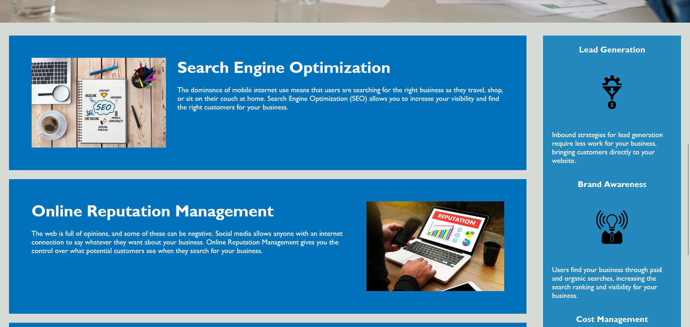
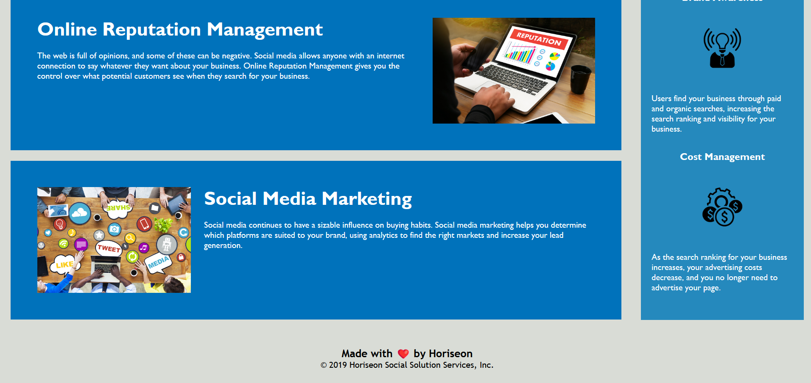

# Module 1 Challenge Project

> On-The-Job assignment required us to change the html formatting to meet accessability standards. Changes made are mentioned in the General Information and Features sections of the README. You can skip directly to changes using the navigation bars below.
> Live demo [My GitHub](https://bradhamm.github.io/Challenge-1-Module-1/).

## Table of Contents
* [General Info](#general-information)
* [Technologies Used](#technologies-used)
* [Features](#features)
* [Screenshots](#screenshots)
* [Setup](#setup)
* [Project Status](#project-status)
* [Room for Improvement](#room-for-improvement)
<!-- * [License](#license) -->

## General Information
- Provide general information about your project here.
In this assignment, we were tasked with refactoring existing code and improving accessability standards to meet client expectations in the acceptance criteria. Some of these changes included the introduction of semantic elements by replacing div sections and adding alt attributes to images for accessability improvements. All changes are listed within the features section. Attempts were also made to mock-up the preexisting code by reorganizing the CSS classes to better represent their formatting within the html document. The result is a more polished website with greater readability to promote ease-of-access to other programmers in the future and a more comprehensive experience to the visually impared using the accessability features through the webpage. 

## Technologies Used
- HTML5
- CSS3
- Visual Studio Code (1.77)
- Google Chrome (Dev)

## Features
Listed below is the acceptance criteria and the solutions that were implemented to address the associated requests:

GIVEN a webpage meets accessibility standards
WHEN I view the source code
THEN I find semantic HTML elements

>Div and other non-semantic elements were replaced with <figure> and 
 to directly correlate with the contained content. 

WHEN I view the structure of the HTML elements
THEN I find that the elements follow a logical structure independent of styling and positioning

>Semantic additions of <header>, <aside>, <main> and footer consolidate the html code into a logical structure easening the burden of future developers from reverse-inspecting elements to understand HTML formatting.

WHEN I view the icon and image elements
THEN I find accessible alt attributes

>Concise alt descriptions were added to all  elements for accessability, including icons contained in the aside section.

WHEN I view the heading attributes
THEN they fall in sequential order

>All heading attributes have been altered to follow in sequential order>

WHEN I view the title element
THEN I find a concise, descriptive title

>Title of the website has been renamed to: "Horiseon Brand Management and Engagement Website", giving a clear description of the webpage and its contents ahead of inspection.

Additional effort was made to reorganize the classes within the CSS sheet, as to follow the same format as the HTML document. Comments were made seperating them by section, and additional remarks were made on changes between the previous version that may go overlooked if the developer has already worked with the code in the past.

## Screenshots

## Setup
All image links for the webpage, as well as the CSS sheet for the HTML file can be found within the assets folder. The HTML as well as the README (This document) can be found inside the project folder, labeled as Challenge-1-Module-1. All of which can be downloaded directly through github. Using a code editing software, install an extension that allows you to run html code locally from within your browser. If you're using VSCode, it's recommended you use "Run In Browser"

From there, by right clicking the html file, either in its tab or name within the directory tree once you open it inside VSCode, you'll be able to run the webside locally out of a chosen or default we browser. HTML and CSS files can be viewed either from the inspect terminal of your given browser or within VSCode.

## Project Status

Project has fulfilled the requirements listed within the Acceptance Criteria, and is therefore complete. Improvements can be made within the CSS structure, which will be covered in the latter section, as RFI.

## Room for Improvement
Room for improvement:

- CSS class groupings are chaotic and may require some further touchup to prevent redundancy.

To do:

- Merge CSS styling options under more ubiquitous classes, which retain website functionality without compromising readability.

<!-- ## License -->
<!-- This project is open source and available under the [MIT License](). -->
